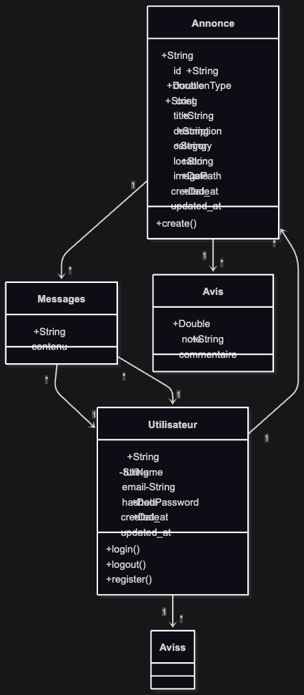
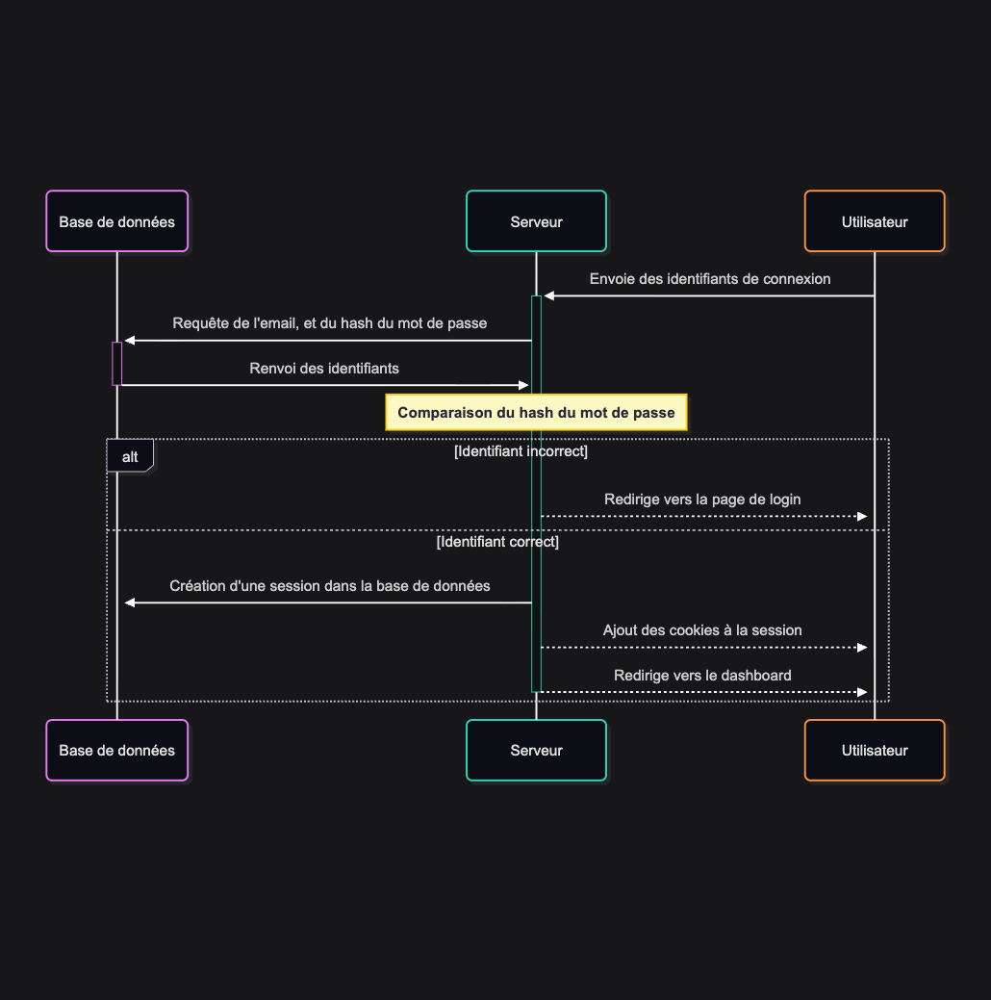
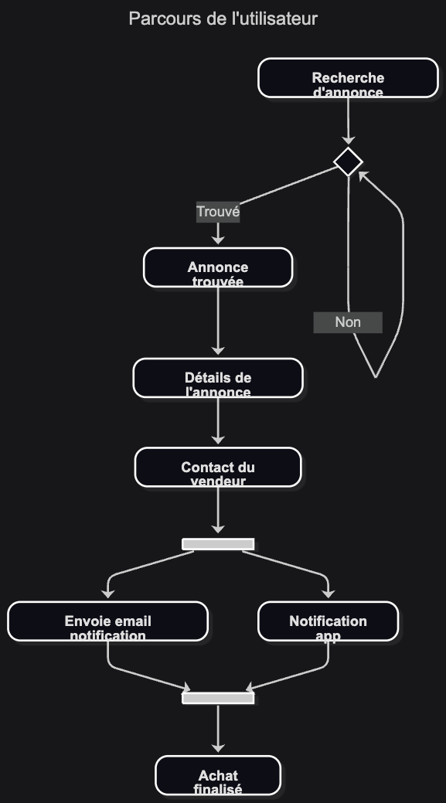

# Projet Génie Logiciel

Ce projet est une application web de gestion d'annonces pour l'UE Génie Logiciel du M1 Informatique à l'Université de Pau.

## Accéder au projet

Le projet est hébergé sur [https://indirent.julienc.me](https://indirent.julienc.me). Vous pouvez y créer un compte, publier des annonces, et interagir avec d'autres utilisateurs.

### Utilisation locale

Pour exécuter le projet en local, suivez les étapes suivantes :

1. Cloner le dépôt GitHub :
   ```bash
   git clone https://github.com/julien040/M1_GL_projet.git
    cd M1_GL_projet
    ```
2. Au premier démarrage, exécuter le script de première fois
    ```bash
    ./premierDemarrage.sh
    ```
3. Démarrer le serveur de développement :
   ```bash
   node ace serve --watch
   ```
4. Ouvrir votre navigateur et accéder à `http://localhost:3333` 

## Ingénierie des Exigences

### Elicitation des exigences

#### **Exigences Fonctionnelles**

- **Authentification des Utilisateurs**
    - **Inscription :** Un nouvel utilisateur doit pouvoir créer un compte en fournissant un
    nom, une adresse email et un mot de passe.
    - **Connexion :** Un utilisateur enregistré doit pouvoir se connecter de manière sécurisée avec son email et un mot de passe.
- **Gestion des Annonces (Objets et Compétences)**
    - **Création d'Annonce :** Un utilisateur identifié doit pouvoir créer une annonce en spécifiant : un titre, une description, une catégorie, une photo, et un prix.
    - **Consultation :** Tout utilisateur (connecté ou non) doit pouvoir parcourir l'ensemble des annonces disponibles.
    - **Recherche et Filtrage :** Un utilisateur doit pouvoir rechercher des annonces par mots-clés et les filtrer par catégorie.
    - **Vue Détaillée :** Un utilisateur doit pouvoir cliquer sur une annonce pour en voir tous les détails ainsi que le profil public du créateur.
- **Échange d’informations**
    - **Demande d'Échange :** Un utilisateur connecté doit pouvoir envoyer une demande sur une annonce, en proposant une contrepartie payante.
    - **Gestion des Demandes :** Le créateur de l'annonce doit pouvoir consulter les demandes reçues, et y répondre
- **Avis**
    - **Notation:** Tout utilisateur peut déposer un avis sur une annonce
- **Système de Notification**
    - **Notifications :** Le système doit envoyer des notifications (par email) pour les événements importants : nouveau message, nouvel avis

#### **Exigences Non Fonctionnelles**

- **Sécurité**
    - Les mots de passe des utilisateurs doivent être stockés de manière chiffrée (hachage).
    - Toutes les communications entre le client et le serveur doivent utiliser le protocole HTTPS.
- **Performance**
    - Le temps de chargement des pages principales (accueil, liste des annonces) ne doit pas dépasser 3 secondes
- **Maintenabilité**
    - Le code doit être documenté et structuré de manière à faciliter les futures évolutions et la correction des bugs.
  
## Conception et architecture logicielle

L'application est construite en suivant une architecture MVC (Modèle-Vue-Contrôleur).

On utilise le patron singleton pour la gestion de la connexion à la base de données. Le framework AdonisJS s'en charge.

### Diagrammes UML

#### Diagramme de classes



#### Diagramme de séquence

Ce diagramme représente le processus de login d'un utilisateur.



#### Diagramme de parcours utilisateur

Ce diagramme montre les différentes étapes qu'un utilisateur suit pour naviguer sur le site, depuis la page d'accueil jusqu'à un achat d'annonce.



## Implémentation

L'application est codée en TypeScript en utilisant le framework AdonisJS. Chaque fonctionnalité est implémentée dans des contrôleurs dédiés, avec des modèles pour interagir avec la base de données, et des vues pour le rendu côté client.

Chaque fonctionnalité a eu sa propre branche Git, et ensuite Pull Request vers la branche principale `main`.

## Tests

Des tests unitaires vérifient que les données utilisateurs sont bien chiffrées.

## DevOps et CI/CD

Grâce à GitHub Actions, un pipeline CI/CD est mis en place pour automatiser les tests et le déploiement de l'application sur un serveur distant à chaque push sur la branche `main`.

Si vous avez accès au dépôt GitHub, vous pouvez consulter le fichier `.github/workflows/deploy.yml` pour plus de détails sur la configuration du pipeline CI/CD.

Vous pouvez aussi voir les historiques des déploiements dans [Actions](https://github.com/julien040/M1_GL_projet/actions).

## Sécurité

L'application chiffre les mots de passe des utilisateurs pour assurer la sécurité.

De plus, l'application utilise des cookies avec une session pour séparer les utilisateurs et protéger les données.

## Maintenance et Evolution

L'application est déployée sur [https://indirent.julienc.me](https://indirent.julienc.mce) et peut être maintenue et mise à jour facilement grâce au pipeline CI/CD mis en place.